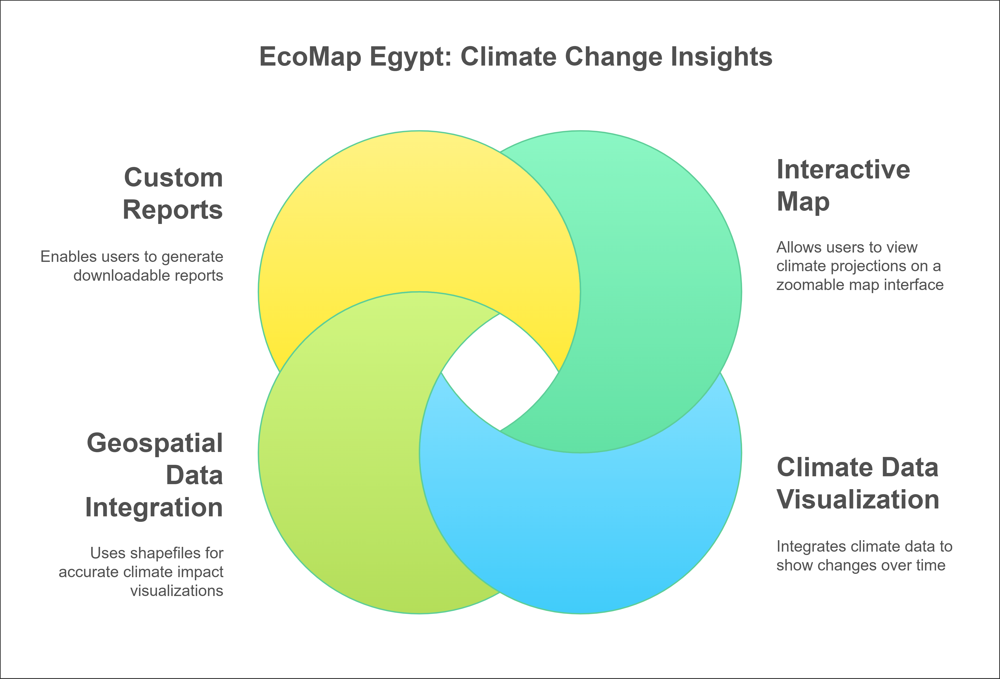
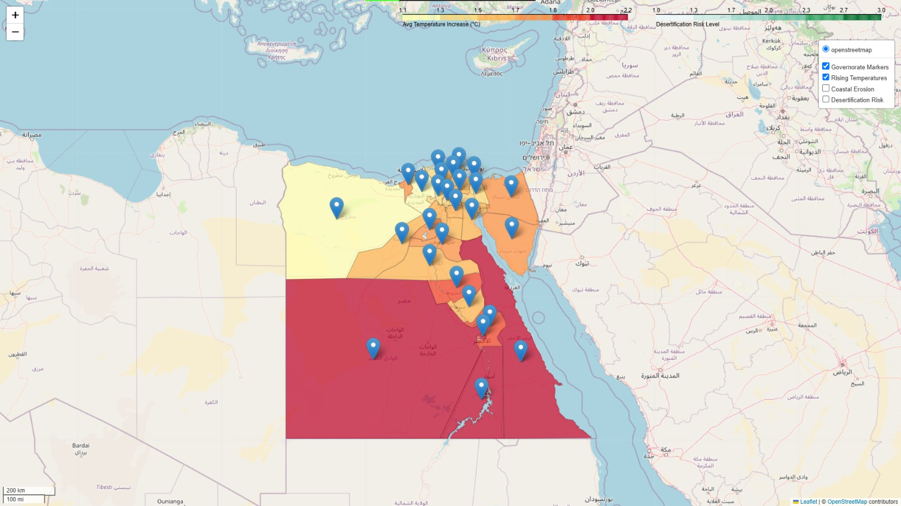

# EcoMap Egypt: Climate Change Insights

## Project Overview

**EcoMap Egypt: Climate Change Insights** is an interactive web-based tool designed to visualize the impacts of climate change on Egypt. This project integrates geospatial and climate data to create an engaging and informative platform that allows users to explore climate risk scenarios. The platform provides valuable insights into how climate change, including temperature variations, sea-level rise, and precipitation changes, is expected to affect different regions in Egypt.

This tool is a resource for researchers, policymakers, and the general public to better understand climate risks and make data-driven decisions for environmental sustainability and adaptation.

## Features

- **Interactive Map**: View climate change projections and their impacts on various Egyptian regions, using a user-friendly, zoomable map interface.
- **Climate Data Visualization**: The platform integrates climate data such as temperature, precipitation, and sea-level rise to illustrate how these factors evolve over time.
- **Geospatial Data Integration**: Uses shapefiles and geo-referenced climate data to provide accurate visualizations of climate impacts.
- **Custom Reports**: Users can generate downloadable reports based on their exploration of the map.

## Key Technologies

This project utilizes a combination of Python, JavaScript, and mapping libraries to build the interactive experience:

- **Python**: For backend processing and creating visualizations using climate data.
- **Folium**: A Python library for generating interactive maps with Leaflet.js.
- **Leaflet.js**: JavaScript library for rendering interactive maps on the web.
- **Shapefiles**: Geographic data format used to define boundaries and regions within the map.
- **HTML/CSS**: To build the frontend interface.
- **JavaScript**: Enhances map interactivity and user interaction with climate data layers.

## Visualizing Climate Change in Egypt

Below is a screenshot of the interactive map interface:

  
*This is an example of the generated interactive climate change map.*

## How to Contribute

We welcome contributions to improve and extend the project! To contribute, follow these steps:

1. Fork the repository.
2. Create a new branch for your feature or bug fix (`git checkout -b feature-name`).
3. Make your changes and commit them (`git commit -am 'Add new feature'`).
4. Push your branch to the remote repository (`git push origin feature-name`).
5. Open a pull request to the main repository.

## License

This project is licensed under the MIT License - see the [LICENSE](LICENSE) file for details.

## Acknowledgments

- **Folium**: For generating interactive maps in Python.
- **Leaflet.js**: A widely used JavaScript library that powers map interactivity.
- **Pandas/Geopandas**: For efficient data manipulation and handling geospatial data.
- **Shapefiles**: For accurate geographic data representation.

## Future Work & Enhancements

We aim to further enhance **EcoMap Egypt: Climate Change Insights** with the following features:

- **Additional Climate Variables**: Integrating more climate variables like wind speed and humidity.
- **Real-time Data Updates**: Implementing real-time updates for climate projections and changes.
- **User Feedback Integration**: Adding a feedback system for users to submit their thoughts and suggestions.

## Contact

For inquiries, suggestions, or support, please reach out via email at [NouryHazem17@gmail.com].

